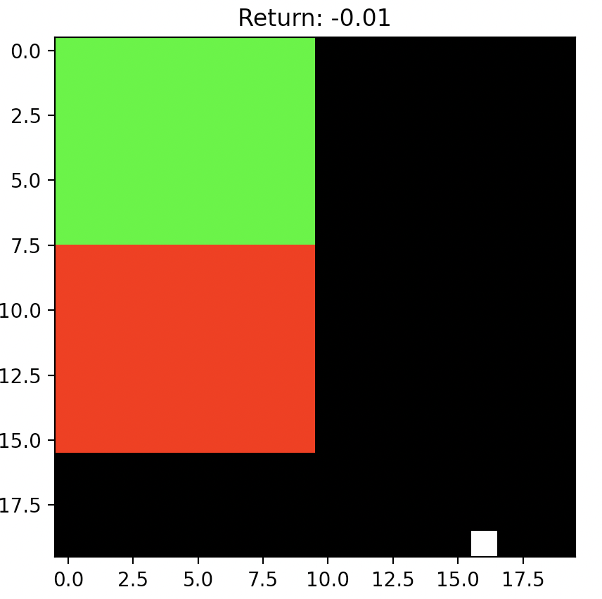

# Navigation Environment for Gym
A simple 2D navigation environment for testing planning or reinforcement learning algorithms that operate on pixels.

The agent (white dot) must navigate to the reward region (green) without hitting and of the bad region (red). Episodes
terminate at the arrival to the red or green zones, or after a set amount of steps. Initial state will be somewhere in the
bottom right region of the board - the exact position is random. All transitions are deterministic (for now).

Observation space: 3 width x height channels, where channel one contains the position of the ball, channel 2 contains a reward
map, and channel 3 shows the location of all terminal states.



## Installation
```
git clone https://github.com/will-maclean/NavigationEnv.git
cd NavigationEnv
pip install -e .
```

## Usage
For a simple example of the environment:

```python
import gym
import navigation

gym.make("Navigation-v0")

state = env.reset()
done = False

while not done:
    action = env.action_space.sample()
    state, reward, done, info = env.step(action)
    env.render()
```

## Environments
*Navigation-vx*

Navigation-vx is the standard environment. All rewards and terminal states are turned on.

*NavigationNoTerminals-vx*

NavigationNoTerminals-vx is the same as Navigation-vx, except there are no terminal transitions. This means that all episodes will continue until the maximum episode length. Useful if only interested in learning transitions.

*v0*

Board is 10x10

*v1*

Board is 20x20

## TODO
- Create version where state space is pixel RGB instead of feature maps